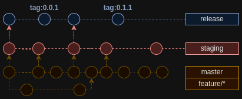

# Git flow

_Lines with arrows symbolize merge_

## `master` and `feature/*` branches

- Normal development
- On each commit there's executed `validate.yml` workflow that runs tests and linter

## `staging` branch

- Finished features from master are merged here for testing
- On each commit there's executed `validate.yml` workflow that runs tests and linter
- There's manual workflow `deploy-staging.yml` that deploys to staging environment

## `release` branch

- Approved features from staging are merged here
- After merge bump version in `package.json` and create a tag equal to the version
- On tag push automatic workflow `deploy-release.yml` is executed that deploys to production environment
